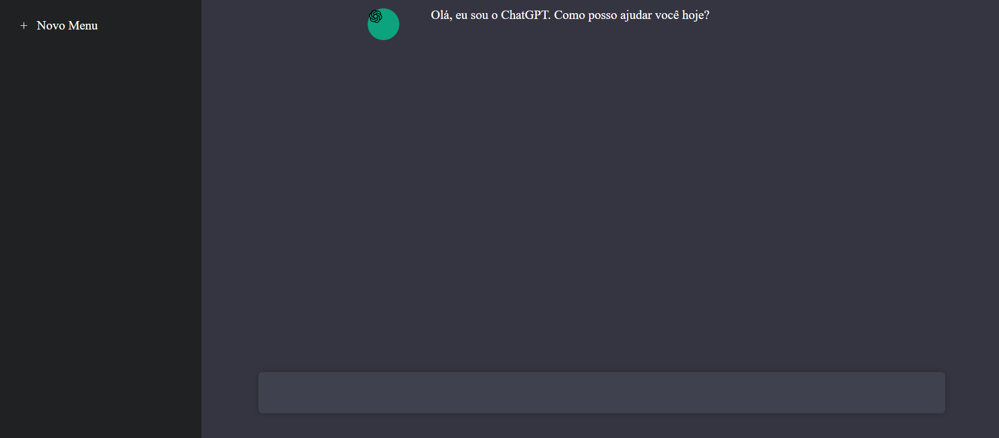

# Chat-GPT Clone com Node.js e React


Este é um projeto de estudo que replica a interface e a funcionalidade básicas do ChatGPT, utilizando React.js para o frontend e Node.js com Express para o backend, integrado diretamente com a API da OpenAI.

## 📸 Screenshot



## ✨ Funcionalidades

- Interface de chat limpa e responsiva.
- Envio de prompts para a API da OpenAI.
- Exibição do histórico da conversa na tela.
- Backend robusto para gerenciar as requisições para a API.

## 🛠️ Tecnologias Utilizadas

- **Frontend (pasta `/web`):**
  - [React.js](https://reactjs.org/)
  - [Axios](https://axios-http.com/) para as chamadas de API
- **Backend (pasta `/server`):**
  - [Node.js](https://nodejs.org/)
  - [Express.js](https://expressjs.com/) para o servidor API
  - [OpenAI Node Library](https://github.com/openai/openai-node)
  - [Dotenv](https://github.com/motdotla/dotenv) para gerenciar variáveis de ambiente

## ⚙️ Pré-requisitos

Antes de começar, você vai precisar ter instalado em sua máquina:
- [Node.js](https://nodejs.org/en/) (que já vem com o npm)
- [Git](https://git-scm.com/)

## 🚀 Instalação e Execução

Siga os passos abaixo para rodar o projeto localmente:

1. **Clone o repositório:**
   ```bash
   git clone [https://github.com/grossitech/chatgpt-clone.git](https://github.com/grossitech/chatgpt-clone.git)
   cd chatgpt-clone
   ```

2. **Configure o Backend (pasta `/server`):**
   ```bash
   # Navegue até a pasta do servidor
   cd server

   # Instale as dependências
   npm install

   # Crie um arquivo .env na raiz da pasta /server
   # e adicione sua chave da API da OpenAI
   touch .env
   ```
   Abra o arquivo `.env` e adicione a seguinte linha, substituindo pelo seu valor:
   ```env
   OPENAI_API_KEY="sk-sua-chave-secreta-aqui"
   ```

3. **Inicie o Backend:**
   Ainda na pasta `/server`, execute:
   ```bash
   npm start
   ```
   O servidor backend estará rodando em `http://localhost:5555` (ou a porta que você configurou).

4. **Configure o Frontend (pasta `/web`):**
   Abra um **novo terminal** e volte para a raiz do projeto.
   ```bash
   # Navegue até a pasta do frontend
   cd web

   # Instale as dependências
   npm install
   ```

5. **Inicie o Frontend:**
   Ainda na pasta `/web`, execute:
   ```bash
   npm start
   ```
   A aplicação React abrirá em seu navegador no endereço `http://localhost:3000`.

## 👨‍💻 Expert


<p>&nbsp&nbsp&nbsp&nbspLuciano Grossi<br/><br/>
    &nbsp&nbsp&nbsp
    <a href="https://github.com/grossitech"></a>
    <a href="https://twitter.com/lucianogrossi"></a>
    <a href="https://www.linkedin.com/in/lucianogrossi"></a>
</p>

